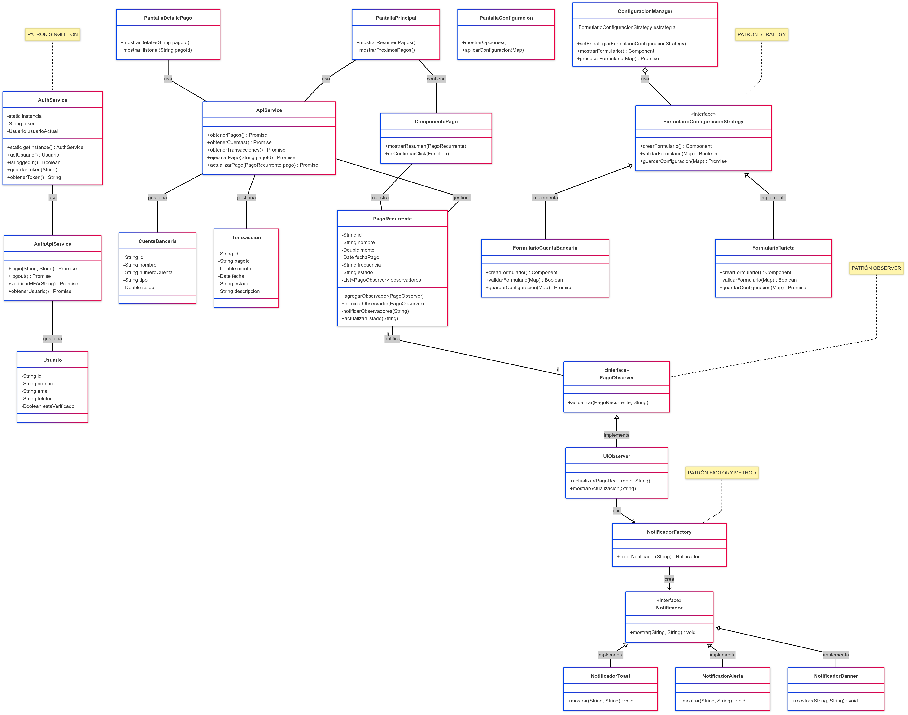
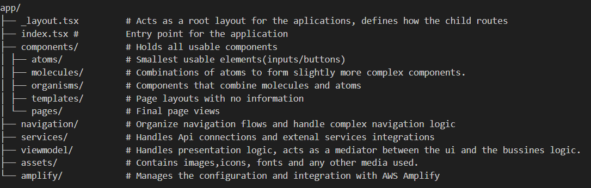
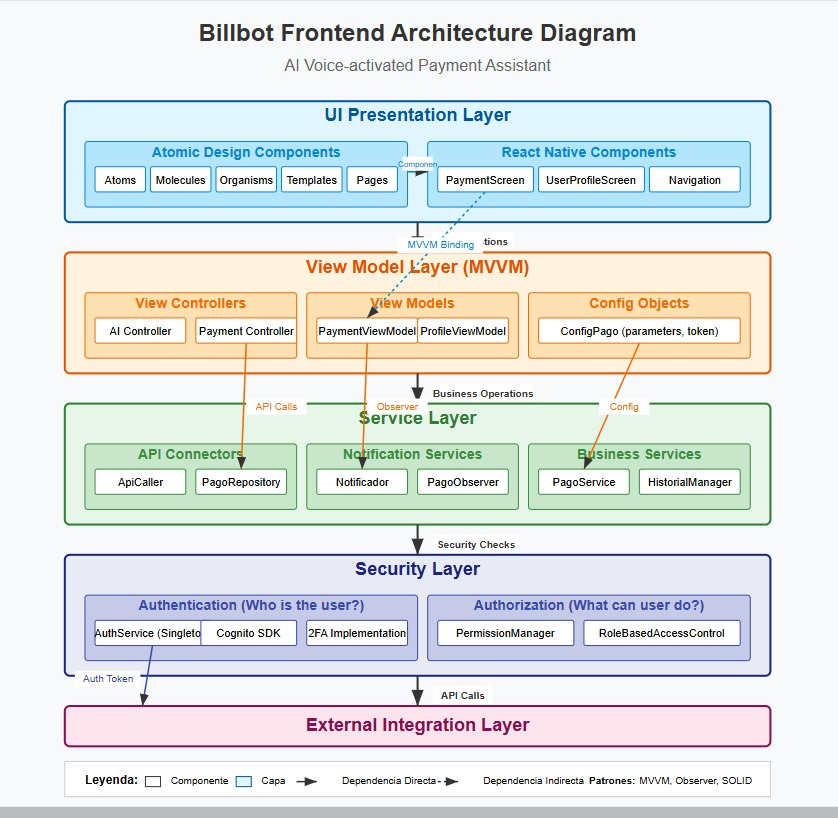
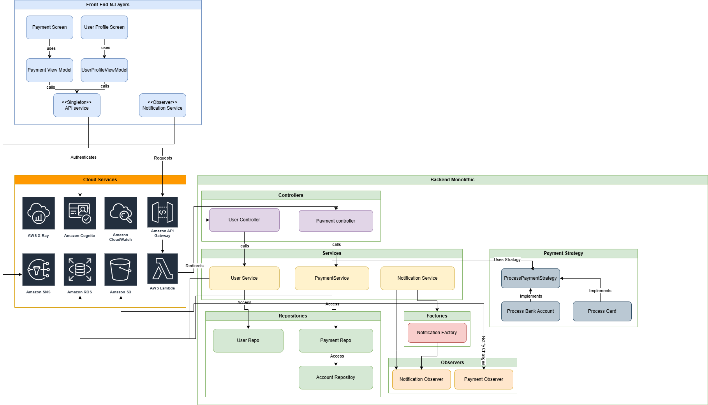

# System Name: Billbot

- David Salazar Rodriguez - 2019000145
- Gabriel Gutiérrez Mata - 2022437833
- Fabricio Picado Alvarado - 2022104933
- Jefferson Salas Cordero - 2022437576

## Description

Billbot is an AI voice-activated payment assistant that allows users to schedule and execute recurring payments seamlessly. By integrating banking APIs and payment processors, Billbot automates transactions and provides a user-friendly experience for managing financial commitments.

## Stack

    React Native

    Cognito - 2FA

    Node.js (NestJS) / Lambda in conjunction API gateaway

    PostgreSQL as the database.

    API´s:
     Plaid / TrueLayer to securely connect the bank accounts.
     Stripe / PayPal API to manage payments and subscriptions within the app.

    AWS for hosting management.

    Cognito to handle 2FA

    AWS CloudWatch for error logs, and infrastructure monitoring and metrics

    AWS X-Ray for errors and tracking services and latency

    Testing:
        React Testing Library for unit tests and frontend integration.

        Postman for API's validation

## Client Architecture

The system will follow an N-Layer architecture, as it promotes a clear separation of concerns. The frontend (React Native) will communicate with the backend (Node.js/NestJS) through secure APIs.

The application utilizes a native mobile architecture based on React Native, allowing a shared codebase between iOS and Android. Rendering is managed entirely on the client side, where the app uses native UI components to deliver responsive content across both platforms.

All interaction and presentation logic is handled on the client side, with the app making API requests to communicate with the backend.

## Frontend Design Specification

### Authentication Platform

**Demo code and customization of login screen**

The selected platform for authentication and MFA implementation is **AWS Cognito**, due to its tight integration with AWS services, strong security model, and built-in MFA support. For the frontend, we used **React Native**, which was chosen as the mobile development framework for this project.

To test Cognito, we created a sandbox environment using **AWS Amplify** and the `Authenticator` component. This allowed us to simulate a complete user sign-up/sign-in flow and test login screen customization.}

**Steps taken:**

1. **Set up AWS Amplify in the React Native project.**

   To get started with **AWS Amplify** in a **React Native** project, first we installed amplify with the command:

```bash
    npm install -g @aws-amplify/cli
```

Then, configure AWS Amplify and integrate it in the project by using the following command:

```bash
    amplify configure
    amplify init
```

2. **Add the Cognito authentication service**
   After integrating amplify in the project we can run the command:

```bash
    amplify add auth
```

This will prompt the configuration for the authentication service.
in this specific project we used the following:

- What authentication method do you want to use?: Identity Pool and User Pool
- Do you want to enable MFA?: Yes (ON)
- Enabled MFA methods: SMS and TOTP

- Sign-in attributes: EMAIL and PHONE_NUMBER

- Required attributes: email and phone_number

- SMS verification message: "Your verification code is {####}"

- SMS authentication message: "Your authentication code is {####}"

- Password policy: Minimum length of 8 characters, no special characters required.

When that configuration is done, we ran the command:

```bash
    amplify push
```

3. **Install dependencies.**
   Scince we are using the the hosted UI we need to install the libraries that are going to provide us with the Authenticator component:

```bash
    npm install aws-amplify @aws-amplify/ui-react-native
```

```bash
    import React from 'react';
    import { withAuthenticator } from '@aws-amplify/ui-react-native';

    const App = () => {
    return <HomeScreen />;
    };

    export default withAuthenticator(App);
```

This will generate a login screen with built-in authentication flow, including the option for SMS-based MFA if enabled.

4. **Customized the login screen UI.**

We adjusted fonts, colors, and button styles using the Amplify UI theme to match the application's branding.

For example:

```bash
    import { Button } from '@aws-amplify/ui-react-native';

    const CustomLoginButton = () => (
    <Button
        title="Sign In"
        style={{ backgroundColor: '#ff6347', borderRadius: 5 }}
    />
    );
```

**MFA Simulation with Postman**
We tested the MFA process with AWS Cognito through Postman by simulating the API interactions.

1. **Create new user:**
   First we need to sign in a new user for us to authenticate later when we make the sign in request.

- Method: POST
- Endpoint: https://cognito-idp.us-east-1.amazonaws.com/

This URL is used because it is the base endpoint for the Cognito Identity Provider service, and combined with specific headers, it allows us to interact with different Cognito actions.

- Headers:
  - Content-Type: application/x-amz-json-1.1
  - X-Amz-Target: AWSCognitoIdentityProviderService.SignUp
- Request body:

```
{
  "ClientId": "your_app_client_id",
  "Username": "exampleuser",
  "Password": "ExamplePassword123!",
  "UserAttributes": [
    {
      "Name": "email",
      "Value": "exampleuser@email.com"
    },
    {
      "Name": "phone_number",
      "Value": "+50612345678"
    }
  ]
}
```

2. **Confirm new sign up:**

- Method: POST
- Endpoint: https://cognito-idp.us-east-1.amazonaws.com/
- headers:
  - Content-Type: application/x-amz-json-1.1
  - X-Amz-Target: AWSCognitoIdentityProviderService.ConfirmSignUp
- Request Body:

```
{
  "ClientId": "your_app_client_id",
  "Username": "exampleuser",
  "ConfirmationCode": "123456"
}
```

Now that we have created a user, we can attempt authentication using this new user.

3. **Initiate authentication:**
   First, we send a POST request to the Cognito login endpoint:

- Method: POST
- Endpoint: https://cognito-idp.us-east-1.amazonaws.com/
- Auth:
  - Auth Type: AWS signature
  - AWS acesskey: Your aws-access-key
  - AWS SecretKey: Your aws-secret-key
- Headers:
  - Content-Type: application/x-amz-json-1.1
  - X-Amz-Target: AWSCognitoIdentityProviderService.AdminInitiateAuth
- Request Body:

```bash
{
    "AuthFlow": "ADMIN_NO_SRP_AUTH",
    "ClientId": "CLIENT_ID_POOL",
    "UserPoolId": "USERPOOL_ID",
    "AuthParameters":
    {
        "USERNAME": "exampleuser@email.com",
        "PASSWORD": "safePassword123!"
    }
}
```

This initiates the authentication process and returns a challenge, which in this case is an SMS MFA challenge.

4. **Receive MFA challenge:**

Cognito responds with a challenge of type **SMS_MFA** and a session token.

5. **Respond to MFA challenge:**
   We then send a second POST request to respond to the MFA challenge.

- Method: POST
- Endpoint: https://cognito-idp.us-east-1.amazonaws.com/

```bash
{
  "ChallengeName": "SMS_MFA",
  "ClientId": "CLIENT_ID_POOL",
  "Session": "SESSION TOKEN"
  "ChallengeResponses": {
    "USERNAME": "exampleuser@email.com,
    "SMS_MFA_CODE": "123456"
  }
}

```

If the MFA code is correct, Cognito responds with valid authentication tokens (idToken, accessToken, refreshToken).

6. **Postman Collection:**
   After testing the MFA flow, we saved the entire collection of API requests in Postman for future reference. The collection includes the Sign up, Sign Up Confirmation, Sign in request, and MFA response request.

## Visual Components

_Patterns & Principles:_

## Patterns & Principles

These principles ensure that the UI is scalable, maintainable, and easy to extend.

### 1. Principios SOLID

#### 1.1. Single

Each class has a single responsibility

- `PagoRepository` use exclusively the payment API communication.
- `Notificador` use notification sends without affecting other functionalities.
- `HistorialManager`use transaction processing and maintains their history.

#### 1.2. Open

Classes are open for extension but closed for modification:

- `ProcesadorPagoStrategy` allows adding new payment processors without altering the core logic.
- `NotificadorFactory` can be expanded to include new notification types.
- `PagoRepositoryImpl` allows method extension without modifying the base structure.

#### 1.3. Liskov

The derived classes can substitute the base ones without altering the behavior:

- `NotificadorEmail`, `NotificadorSMS` and `NotificadorPush` implement the `Notificador` interface while maintaining its base contract.
- `ProcesadorBancario` and `ProcesadorTarjeta` extend `ProcesadorPagoStrategy`, allowing the payment method to be changed without modifying the core functionality.

#### 1.4. Interface

Interfaces are small and focused:

- `ProcesadorPagoStrategy` defines specific methods for payment processors.
- `Notificacion` use exclusively the sending of notifications.
- `PagoObserver` defines change notifications for `PagoRecurrente`.

#### 1.5. Dependency

Modules depend on abstractions, not concrete implementations:

- `ContextoPago` depends on `ProcesadorPagoStrategy`, allowing the implementation to be changed without modifying the controller.
- `AuthService` provides authentication and user validation through a single entry point.

### 2. Principio DRY

Eliminates duplication through reuse:

- `PagoRepositoryImpl` centralizes data access logic to avoid repetition across different services.
- `HistorialManager` encapsulates transaction history management, preventing logic duplication in multiple places.

### 3. Separation of Concerns

Responsibilities are divided into distinct layers:

- **Models** like `PagoRecurrente`, `Usuario`and `Transaccion` handle data structures
- **Repositories** like `PagoRepository` manage data access.
- **Services** like `PagoService`and `UsuarioService` contain business logic.
- **Controllers** like `PagoController` handle UI communication
- **Observers** like `PagoObserver` and `NotificacionObserver` enable system event response

### 4. Patrones de Diseño

#### 4.1. MVVM (Model-View-ViewModel)

- **Model:** Data structures like `Usuario`, `CuentaBancaria` and `Transaccion` with defined types.
- **View:** Visual components such as `PaymentScreen`and `UserProfileScreen`.
- **ViewModel:** Presentation logic classes like `PaymentViewModel`, integrated with React Native hooks including `useState` and `useEffect`.

#### 4.2. Repository

- `PagoRepositoryImpl` manages payment persistence and encapsulates database access.
- `PageRepositoryImpl` extends `PageRepository`, to ensure flexible handling of recurring payments

#### 4.3. Factory

- `NotificadorFactory` creates `Notificador` instances based on notification type (SMS, Email, Push)

#### 4.4. Strategy

- `ProcesadorPagoStrategy` enables swapping payment methods without modifying core logic.
- `ProcesadorBancario` and `ProcesadorTarjeta` implement specific payment strategies.

#### 4.5. Observer

- `PagoObserver` enables subscription-based notifications for users.
- `NotificacionObserver` use notification status updates.

#### 4.6. Singleton

- `AuthService` ensures only one authentication instance exists application-wide.

## Toolkits & Estándares

We adopt tools that facilitate the implementation and maintenance of visual components, ensuring consistency across both iOS and Android platforms.

### 1. React Native

- `Cross-platform` mobile development framework for iOS/Android.
- Optimized native components including `FlatList`, `Button`, and `View`.
- Built-in support for native modules.

### 2.React Navigation

- Navigation management with `StackNavigator`, `DrawerNavigator`, and `BottomTabNavigator`, enabling smooth transitions between screens.
- Passing parameters between screens using `route.params`, simplifying data transfer between views.

### 3. Componentes UI

- `SafeAreaView` to use safe areas on devices with notches or curved edges.
- `Vector-icons` for consistent iconography across platforms.
- `Gesture-handler` to efficiently manage touch interactions.

### 4. Platform Standards

- Use of `cross-platform` design principles.
- Visual components like buttons, lists, and text fields follow guidelines that ensure a coherent interface without requiring adjustments between platforms.

### 5. Complementary Modules

- `react-native-safe-area-context` for safe area management.
- `expo-font` for loading custom fonts.
- `expo-asset` for optimized handling of images and resources.
- `@expo/vector-icons` for a cross-platform icon library.

## Object design patterns



## External services

## A. UI ↔ Business Logic (Frontend)

**Interaction between UI and client-side logic.**

| Component            | Tech + Pattern          | Description                                                          | Relationships                                                         |
| -------------------- | ----------------------- | -------------------------------------------------------------------- | --------------------------------------------------------------------- |
| **PaymentViewModel** | MVVM (React Hooks)      | Payment logic, validates inputs and communicates with PagoRepository | `PaymentScreen UI` ↔ `PagoRepository` ↔ `Stripe/APIs`                 |
| **AuthService**      | Singleton + Cognito SDK | Manages user authentication (login, and 2FA)                         | `LoginScreen UI` ↔ `AWS Cognito` ↔ `NestJS BE`                        |
| **Notificador**      | Observer                | Listens to payment events and triggers SMS/notifications             | `PagoRepository` ↔ `AWS SNS (NestJS)`                                 |
| **PagoRepository**   | -                       | API calls for payments and bank operations                           | `PaymentViewModel` ↔ `NestJS backend` ↔ `Stripe/Plaid/TrueLayer APIs` |

## B. External Services Integrations

### 1. Authentication and Authorization

| Service     | Technology  | Description                         | Relationships                               |
| ----------- | ----------- | ----------------------------------- | ------------------------------------------- |
| **Cognito** | Cognito SDK | Handles user authentication and 2FA | `AuthService (frontend)` ↔ `NestJS backend` |

### 2. SaaS and Payment Platforms

| Service             | Technology | Description                            | Relationships                            |
| ------------------- | ---------- | -------------------------------------- | ---------------------------------------- |
| **Stripe/PayPal**   | Stripe SDK | Payments processes and subscriptions   | `ProcesadorPagoStrategy (BE)` ↔ `NestJS` |
| **Plaid/TrueLayer** | Plaid SDK  | Links bank accounts and retrieves data | `PagoRepository` ↔ `NestJS BE`           |

### 3. External APIs

| Service     | Technology | Description             | Relationships                    |
| ----------- | ---------- | ----------------------- | -------------------------------- |
| **AWS SNS** | SNS API    | Sends reminders via SMS | `Notificador (FE)` ↔ `NestJS BE` |

### 4. Monitoring

| Service            | Technology | Description               | Relationships             |
| ------------------ | ---------- | ------------------------- | ------------------------- |
| **AWS CloudWatch** | CloudWatch | Metrics and Log errors    | `NestJS/Lambda (BE only)` |
| **AWS X-Ray**      | X-ray      | Traces API errors/latency | `API Gateway` ↔ `Lambda`  |

## Project structure



The following diagram illustrates the comprehensive frontend architecture for Billbot, an AI voice-activated payment assistant. This architecture follows a layered design that emphasizes separation of concerns, high cohesion, and low coupling between components, adhering to SOLID principles throughout.
The architecture is organized into five distinct layers:

- UI Presentation Layer: Using Atomic Design methodology and React Native components to build a cohesive, responsive user interface across platforms.
- View Model Layer (MVVM): Implementing the Model-View-ViewModel pattern to separate UI from business logic, with dedicated controllers, models, and configuration objects.
- Service Layer: Handling API connections, notifications, and core business services that power the application's payment functionality.
- Security Layer: Managing authentication and authorization through Cognito integration with 2FA, ensuring secure access to payment operations.
- External Integration Layer: Connecting to third-party payment processors, banking APIs, and cloud services.

The architecture employs several design patterns including Observer for notifications, Singleton for authentication services, and Factory for creating various service implementations. Communication between layers follows a strict top-down approach with clearly defined interfaces, allowing for better testability and maintenance.
As shown in the diagram below, each component has specific responsibilities and communicates with others through well-defined paths, ensuring a robust foundation for scaling the application's functionality.



# Backend Design Specifications

## Backend Design Specifications

### Proof of Concepts

## POC

POC Step 1: Handler Responsibilities (SOLID & Cohesion Principle)

    Challenge:
    Handlers in the original template mixed the business logic and data, and accesing repositories directly, that led leading to low cohesion and hard-to-maintain code

    Solution:

        Split responsibilities into two distinct handlers:

            getUserBalanceHandler for checking balance and initiating payment

            paymentHandler for processing card payments

        Introduced a service layer (UserService, PaymentService, logger) that encapsulates business logic and interacts with repositories

    Advantages over Original Template:

        Clearer responsibilities: Each handler now has a single task, better defined

        Decoupling: Handlers no longer access repositories directly, making testing and other aspects like scalability easier

        Maintainability: Future changes in business logic or data sources only affect the service layer, not the handlers

POC Step 2: README.md Fixes & Adjustments

    Challenge:
    Original README lacked documentation of deployment issues and fixes, causing confusion around Serverless configuration and AWS permissions

    Solution Chosen:

        Updated the README to include:

            A list of encountered errors (reserved environment variables, IAM permission issues)

            Step by step fixes applied (e.g., removing AWS keys from .env, adding serverless-plugin-typescript, adjusting provider.environment)

            Clearer and better instructions

    Advantages over Original Template:

        Reproducibility: easier to clone and run

        Transparency: Common errors are documented.

        Onboarding speed: Reduced time to first success for team members

POC Step 3: Logger Improvements (Design Pattern Required)

    Challenge:
    The template used only console.log, which was unsuitable for production serverless apps (no persistence, no configurable destinations, etc)

    Solution Chosen:

        Defined a Logger interface and two implementations:

            ConsoleLogger (for local developement)

            CloudWatchLogger (writes to AWS CloudWatch)

        Applied the Strategy Pattern so the logger can be swapped based on NODE_ENV.

    Advantages over Original Template:

        Environment specific logging: Development logs can stay local, and production logs persist in CloudWatch

        Extensibility: new logger implementations can be added without changing handlers

        Better observability: new logs improve monitoring and debugging

POC Step 4: Optional & Mandatory Middleware (Design Pattern Required)

    Challenge:
    The original template didnt have a structured middleware system. All middleware were optional or hardwired, and authentication wasnt guaranteed, so create a new structure and replace the old one was tricky

    Solution Chosen:

        Created witMiddleware functions using the Chain of Responsibility Pattern.

        Allowed separation of mandatory middlewares (authMiddleware) from optional ones (loggerMiddleware)

        Each middlewares execute() either throws an error or passes control to the next.

    Advantages over Original Template:

        Flexible chaining: Easily manipulate middlewares (add, modify and delete).

        Enforced authentication: non optional middleware always runs first, to avoid unauthorized access

        Modularity: Each middleware focuses on a single task (auth, validation, logging)

POC Step 5: Repository Layer Improvements (Decoupling & Reusability)

    Challenge:
    Handlers accessed repositories directly, mixing data with business. No multiple data sources or swapping of repositories

    Solution Chosen:

        Introduced a service layer (UserService, PaymentService, logger) between handlers and repositories

        Repositories remain simple data access classes, while services handle business rules

    Advantages over Original Template:

        Decoupling: Business logic and data are now separated

        Reusability: Services can be reused in othe contexts

        Testability: repositories con mock in tests without touching handlers

POC Step 6: Deployment & Testing

    Challenge:
    The original template had no automated tests or DB cloud integration.

    Solution Chosen:

        Implemented two unit test functions (with Jest), to simulate APIGatewayProxyEvent and its context

        services were configurated to read from simulated cloud database (repos in memory).

        a Postman collection with two requests for the live endpoints (/example-one, /example-two), including headers and bodies

    Advantages over Original Template:

        testing: handler logic remains correct during changes

        Cloud integration: Services already structured to connect to real cloud databases

        Easy testing: Postman collection lets developers quickly validate the deployed API

### Backend Architecture

A **modular monolithic** architecture is adopted for the backend, using the **NestJS** framework on **Node.js**.

#### Internal layers handling requests/responses

A layered architecture is employed to ensure a clear separation of responsibilities:

- **Controller**: Handles HTTP requests/responses (e.g., PagoController, UsuarioController).

- **Service**: Contains business logic (e.g., PagoService, UsuarioService).

- **Repository**: Manages data access (e.g., PagoRepositoryImpl, UsuarioRepositoryImpl).

#### Interaction of design patterns with requests or other triggers

**Dependency Injection**

Used natively in NestJS to decouple classes from each other.

- Allows injecting repositories, domain services, and adapters without coupling implementations.
- Facilitates unit testing and architectural flexibility.

---

**Command Handler**

Clearly separates read and write operations.

- `CreatePagoCommandHandler`: Handles payment creation logic.
- `ActualizarEstadoCommandHandler`: Processes transaction state changes.

---

**Event Sourcing**

Used to record significant events in the financial system.

- Each relevant action generates an event (`PagoRealizadoEvent`, `CuentaBloqueadaEvent`) that can be replayed to reconstruct the system's state.

**Decorator**

Extensively used for validation, authorization, and data transformation.

- Decorators like `@UseGuards`, `@Roles`, `@Transform`, and custom validators apply cross-cutting rules to the system.

**Adapter**

Part of the hexagonal architecture to isolate external dependencies.

- Examples: `StripeAdapter`, `PlaidAdapter`.
- Enables integration with third-party services without coupling to the domain core.

**Template Method**

Applied in abstract services that define reusable common flows.

- `BaseServicioPago`: Defines generic steps for payment processing.
- Subclasses complete specific logic for banks, cards, etc.

---

### 2. Serverless, Cloud, On-Premise, or Hybrid?

A **Serverless cloud solution (AWS)** is adopted for its automatic scalability, cost efficiency, and ease of integration.

#### Hardware and cloud machine types

These are the technologies and services we will use:

**AWS Lambda**

- Executes serverless functions without the need to manage servers.
- Classes like `PaymentService` create on-demand payments, and `TransactionHandler` efficiently processes transactions.

**RDS PostgreSQL**

- Stores transactional data, ensuring consistency.
- `PaymentRepository` stores payment details, and `UserRepository` stores user data.

**AWS API Gateway**

- Manages scalable API request traffic.
- Classes like `PaymentController` handle payment requests, and `UserController` manages user requests.

**AWS Cognito**

- Manages user authentication and authorization.
- `AuthService` handles user authentication, and `SessionManager` validates user sessions.

**Amazon SNS**

- Sends notifications at scale.
- Classes like `NotificationService` send notifications about payment or account status, and `PaymentProcessor` sends notifications after processing a payment.

**CloudWatch**

- Provides real-time monitoring and tracking.
- `ErrorLogger` logs errors and exceptions, and `TransactionTracker` tracks transactions to improve performance.

#### Impact on frameworks, libraries, and languages

These are the frameworks, libraries, and languages we will use:

| Technology   | Role              | Main Advantage                                  |
| ------------ | ----------------- | ----------------------------------------------- |
| Node.js      | Backend runtime   | Non-blocking I/O, high performance in the cloud |
| NestJS       | Backend framework | Modular, supports MVC, scalable                 |
| TypeScript   | Base language     | Strong typing, maintainability, and scalability |
| PostgreSQL   | Database          | ACID integrity, complex queries                 |
| Stripe/Plaid | External gateways | Reliable, secure, widely adopted                |

---

### 3. Service vs. Microservices?

A **service-based architecture** is used to facilitate responsibility separation and enable progressive scalability.

#### Logical divisions to distribute workload

| Service             | Main Responsibility                         |
| ------------------- | ------------------------------------------- |
| AuthService         | Authentication and authorization management |
| PaymentService      | Payment processing                          |
| SubscriptionService | Subscription plan management                |
| NotificationService | Notification delivery                       |
| UserService         | User registration and profile management    |

#### Impact on code organization and team collaboration

- **Branching Policy**:

The **GitFlow** strategy is used for branch management.

- **main**: Main branch containing the stable version of the code.
- **develop**: Development branch containing new features and fixes before merging into `main`.
- **Feature branches**: Each new feature is developed in a separate branch from `develop` and merged back once completed.
- **Release branches**: Created for preparing new versions, merged into `main` and `develop` afterward.
- **Hotfix branches**: Created for critical production fixes, merged into `main` and `develop`.

- **Versioning and Release Management**:

The **SemVer** (Semantic Versioning) convention is followed: `MAJOR.MINOR.PATCH`.

- For each stable release, the **`PATCH`** number is incremented for minor fixes, **`MINOR`** for new features without breaking compatibility, and **`MAJOR`** for disruptive changes that break compatibility.
- A system of **weekly releases** with incremental versions is implemented.
- Each team is exclusively responsible for its respective service (e.g., `PaymentService`, `UserService`).

- **Collaboration and Branch Usage**:

- Teams collaborate using **pull requests** to integrate changes into `develop` or `release` branches.
- Code reviews are mandatory before merging any branch into `main` or `develop`.
- **Change documentation** is encouraged in each pull request to facilitate understanding of modifications.
- Teams must follow a **CI/CD** process that automates testing and deployments to staging or production environments.

- **Team Scalability**:

- Dividing responsibilities by service facilitates team growth, as each team specializes in a specific service.
- As the system scales, teams can migrate from a monolithic structure to **microservices** if necessary, without disrupting workflows.

---

### 4. Event-Driven, Queues, Brokers, Producer/Consumer, Pub/Sub?

#### Parts requiring these architectures

- Payment confirmation
- Automatic billing reminders
- Event logging for traceability

#### Cloud services providing these features

| Event              | AWS Service          | Architecture Pattern |
| ------------------ | -------------------- | -------------------- |
| Payment completed  | EventBridge + Lambda | Pub/Sub              |
| Pending reminder   | EventBridge + Lambda | Pub/Sub              |
| Subscription error | EventBridge + Lambda | Pub/Sub              |

#### Integration layers and classes used

- `PagoService`: Emits events
- `NotificadorService`: Event subscriber
- `EventoService`: Flow orchestrator
- `LoggerService`: Event and error persistence

---

### 5. API Gateway (Security & Scalability)

#### Is an API Gateway necessary?

Yes. **AWS API Gateway** is used to manage traffic to the serverless backend.

#### Selected cloud service

- **AWS API Gateway**: Natively integrates with AWS Lambda and Cognito.

#### How does it support security and scalability?

##### Security

- Authentication with JWT via AWS Cognito.
- CORS validation.
- Throttling and quotas per user or IP.
- Integration with AWS WAF for custom rules.

##### Scalability

- Automatically scales horizontally.
- Handles hundreds or thousands of concurrent requests without manual intervention.
- Provides caching, logging, and metrics for continuous optimization.

### Data Layer Design

### 1. data layer design

#### a) Data topology

App Assistant uses a single PostgreSQL database hosted on Amazon RDS. Data is replicated for high availability and automatic failover. Access is restricted to internal AWS services through security groups and IAM roles.

Benefits:

    Open source, no licensing costs

    Fully managed by AWS RDS (backups, replication, monitoring)

    Scalable and reliable storage

    Native support for encryption and access control

#### b) Big Data Repository

No integration with big data repositories is planned. Data will not be used for data science or machine learning in the near future.

Benefits:

    Simplified architecture

    Lower operational complexity and cost

    No need for batch pipelines or data lake infrastructure

#### c) Relational Database

A relational database engine is used (PostgreSQL), hosted on AWS RDS.

Benefits:

    Naturally transactional system requiring strong data consistency

    Supports ACID transactions ("all or nothing")

    Structured schema enables complex queries

#### d) Data Access Permissions

The system is multitenant, with strict separation of data per tenant via PostgreSQL Row-Level Security (RLS). Authentication and identity are managed by AWS Cognito.

Data encryption and hashing:

    User emails and contact info: encrypted at rest (RDS)

    Payment configuration data: encrypted

    Passwords: hashed using bcrypt

    Checksums: applied on transaction, payment, and log tables

Access control design:

    Tenancy enforced at data-access layer through RLS

    Repository layer assumes access boundaries are already enforced

    All access is logged via CloudWatch and RDS audit logs

Benefits:

    Prevents cross-tenant data leakage

    Maintains security even in case of programming errors or breaches

    Supports centralized logging and auditing for accountability

#### e) fail tolerance and recover model and politics

RDS provides automated backups and failover for high availability. CloudWatch monitors system and triggers alerts, and with AWS X-Ray helps trace faults in different requests.

Policies:

    Continuous backups enabled (RDS)

    CloudWatch alarms on key points

    Automatic failover in case of primary failure

Benefits:

    Reduced downtime

    Fast and automated recovery

    Proactive maintenance

### 2. object oriented design - programming

#### a) Transactional via SQL Statements

AWS RDS PostgreSQL

Class layers for data access:

    Repositories like PagoRepositoryImpl, UsuarioRepositoryImpl, CuentaRepositoryImpl, expose transactional methods, enabling multi-entity operations under a single transaction context

Policies:

    Auto rollbacks on timeout
    
    isolation levels set by default
    
    retry on failure logic applied at service level

Benefits:

    Data consistency
    
    better testability
    
    portable and maintainable transaction logic

#### b) use of ORM

ORM:

    TypeORM with AWS RDS PostgreSQL.

Patterns:
    
    Entity-repository pattern
    
    repositories extend TypeORM base classes.

Class layers:
    
    Entities defined with decorators
    
    services interact via repositories.

Policies:

    Validation at the entity level using class-validator.

Benefits:
    
    Higher developer productivity
    
    centralized schema control
    
    consistent data access.

#### c) Layers for connection control, concurrency, data mapping, and object/data models

Cloud service:

    AWS RDS PostgreSQL with built-in connection pooling.

Design patterns:
    
    Singleton for managing a shared pool
    
    Factory for creating connections.

Policies:
    
    Transaction isolation
    
    mapping conventions
    
    connection limits (max/idle time).

Benefits:
    
    Thread-safe access
    
    improved performance
    
    clear separation of concerns.

#### c2) pool use for connections

Cloud service:

    AWS RDS PostgreSQL with RDS Proxy to efficiently manage multiple concurrent connections.

Design pattern:

    Singleton for ConnectionPoolManager to ensure a single shared instance manages the pool.

Values to configure:

    max_connections: 50    
    Maximum number of concurrent connections managed by the pool.

    idle_client_timeout: 1800 seconds (30 minutes)  
    Maximum time an idle connection can stay open.

    connection_borrow_timeout: 30 seconds  
    Max wait time to borrow a connection from the pool.

    init_query: "SELECT 1"
    Query used to validate active connections.

    enable_logging: "true"  
    Enables monitoring and logging via Amazon CloudWatch.

Policies:

    Set maximum pool size
    
    connection timeout
    
    validate active connections
    
    enable monitoring metrics.

Expected benefits:

    Improved scalability
    
    reduced overhead from reconnections
    
    centralized and maintainable configuration.

#### d) use of cache

Technology:

    Redis, for frequently accessed data.

Patterns:
    
    Read-through cache pattern
    
    Singleton for shared Redis manager.

Data access layers:
    
    Repositories query RedisCacheManager before hitting the database.

The values to create are:

| Enitity                   | Redis key example            | 
| ------------------------- | ---------------------------- | 
| Account list per user     | `user:5421:account`          | 
| Payment record            | `payment:record:account:779` | 
| Active session            | `session:token:abc123xyz`    | 


Policies:
    
    Monitor performance and memory usage
    
    use structured cache keys
    
    apply cache only to selected high-demand data.

Benefits:
    
    Faster response times
    
    improved user experience
    
    reduced database load.

#### e) Native vs Interpreted Drivers

Technology:
    
    AWS RDS PostgreSQL accessed via native drivers for optimal performance.
    
Driver to use for Node.js environments is:
    [`pg` (node-postgres)](https://www.npmjs.com/package/pg) 

Patterns:
    
    Strategy Pattern to switch between execution methods as needed.

Use:

    Native drivers (like pg) for critical queries and procedures
    
    monitored for performance.

Benefits:
    
    Greater efficiency
    
    Flexibliity in query handling

    Integrates better with PostgreSQL features

#### f) data design

Technology:

    AWS RDS with PostgreSQL as the primary relational database engine.

Patterns:
    
    Repository pattern to encapsulate query logic for each entity class.

Key Tables design:

users:

``` sql
CREATE TABLE users (
    user_id SERIAL PRIMARY KEY,                        -- Unique user ID
    email VARCHAR(255) UNIQUE NOT NULL,                -- Unique email
    password_hash TEXT NOT NULL,                       -- Hashed password
    first_name VARCHAR(100),                           -- User's first name
    last_name VARCHAR(100),                            -- User's last name
    created_at TIMESTAMPTZ DEFAULT CURRENT_TIMESTAMP,  -- When the account was created
    updated_at TIMESTAMPTZ DEFAULT CURRENT_TIMESTAMP   -- Last account update
);
```
accounts:

``` sql
CREATE TABLE accounts (
    account_id SERIAL PRIMARY KEY,                            -- Unique account ID
    user_id INT REFERENCES users(user_id) ON DELETE CASCADE,  -- Foreign key to users
    balance DECIMAL(10, 2) DEFAULT 0.00,                      -- Account balance
    status VARCHAR(50) DEFAULT 'active',                      -- Account status (active, suspended, etc.)
    created_at TIMESTAMPTZ DEFAULT CURRENT_TIMESTAMP,         -- When the account was created
    updated_at TIMESTAMPTZ DEFAULT CURRENT_TIMESTAMP          -- Last account update
);
```

sessions (manages active session, important to keep securuty):

```sql
CREATE TABLE sessions (
    session_id SERIAL PRIMARY KEY,                            -- Unique session ID
    user_id INT REFERENCES users(user_id) ON DELETE CASCADE,  -- Foreign key to users
    session_token TEXT UNIQUE NOT NULL,                       -- Unique token for session
    ip_address INET,                                          -- User's IP address during the session
    user_agent TEXT,                                          -- User's browser or device information
    created_at TIMESTAMPTZ DEFAULT CURRENT_TIMESTAMP,         -- When the session was created
    expires_at TIMESTAMPTZ                                    -- When the session expires
);
```

Class layers:
    
    Repository layer
    
    Data transfer layer
    
    Entity model.

Configuration policies/rules:
    
    Normalization
    
    Naming conventions
    
    Maintaining clarity in schema design.

Expected benefits:
    
    Improved clarity
    
    Reusability
    
    Maintainability
    
    Data integrity
    
    scalability

## Architecture Design



## Architecture Compliance Matrix

This matrix shows how architectural components fulfill the system's functional and non-functional requirements.

## Compliance Matrix

| Requirements vs. Components     | Frontend (React Native) | Atomic Design | MVVM | API Gateway | Auth Service (Cognito) | Backend (NestJS) | Services & Repositories | AWS Lambda | PostgreSQL DB | AWS S3 | Redis Cache | AWS CloudWatch | AWS SNS |
| ------------------------------- | ----------------------- | ------------- | ---- | ----------- | ---------------------- | ---------------- | ----------------------- | ---------- | ------------- | ------ | ----------- | -------------- | ------- |
| **Functional Requirements**     |                         |               |      |             |                        |                  |                         |            |               |        |             |                |         |
| Voice Interaction               | X                       | X             | X    |             |                        | X                |                         | X          |               |        |             |                |         |
| Payment Configuration           | X                       | X             | X    | X           | X                      | X                | X                       | X          | X             |        | X           |                |         |
| Payment Execution               | X                       |               | X    | X           | X                      | X                | X                       | X          | X             |        | X           | X              | X       |
| **Non-Functional Requirements** |                         |               |      |             |                        |                  |                         |            |               |        |             |                |         |
| Scalability                     | X                       |               |      | X           | X                      | X                | X                       | X          | X             | X      | X           | X              | X       |
| Security                        | X                       |               |      | X           | X                      | X                | X                       | X          | X             | X      |             | X              |         |
| Performance                     | X                       | X             | X    | X           |                        | X                | X                       | X          | X             |        | X           | X              |         |
| Availability                    |                         |               |      | X           | X                      | X                |                         | X          | X             | X      | X           | X              | X       |
| Compatibility                   | X                       | X             |      |             |                        |                  |                         |            |               |        |             |                |         |
| Usability                       | X                       | X             | X    |             |                        |                  |                         |            |               |        |             |                |         |

## Compliance Analysis

### Key Functional Requirements

1. **Voice Interaction**

   - Frontend React Native: UI for voice capture
   - Atomic Design: Modular components for voice interface
   - MVVM: Separation of voice processing logic
   - Backend (NestJS): Voice command processing
   - AWS Lambda: Serverless functions for NLP

2. **Payment Configuration**

   - Frontend: Interfaces for account and payment setup
   - API Gateway: Secure management of configuration requests
   - Auth Service (Cognito): Authentication for sensitive operations
   - Services & Repositories: Business logic and storage
   - PostgreSQL: Persistence of configurations
   - Redis Cache: Fast access to frequent configurations

3. **Payment Execution**
   - API Gateway: Access control for payment operations
   - Auth Service: Authentication to authorize payments
   - NestJS Backend: Payment processing logic
   - AWS Lambda: Scalable transaction processing
   - AWS SNS: Confirmation notifications
   - AWS CloudWatch: Transaction monitoring

### Non-Functional Requirements

1. **Scalability**

   - AWS Lambda: Automatic serverless scaling
   - API Gateway: High concurrency management
   - PostgreSQL: Configured for high load
   - AWS CloudWatch: Performance monitoring

2. **Security**

   - Auth Service (Cognito): 2FA, token management
   - API Gateway: Rate limiting, authorization
   - NestJS: Security middleware, validation
   - PostgreSQL: Encryption, access policies

3. **Performance**

   - Redis Cache: Fast access to frequent data
   - API Gateway: Route optimization
   - AWS Lambda: On-demand processing
   - NestJS: Query optimization

4. **Availability**

   - AWS Lambda: High serverless availability
   - PostgreSQL: Replication and failover
   - AWS CloudWatch: Alerts and monitoring
   - AWS SNS: System notifications

5. **Compatibility and Usability**
   - React Native: Cross-platform support
   - Atomic Design: Consistent and adaptable interfaces
   - MVVM: Clear separation facilitating maintenance
